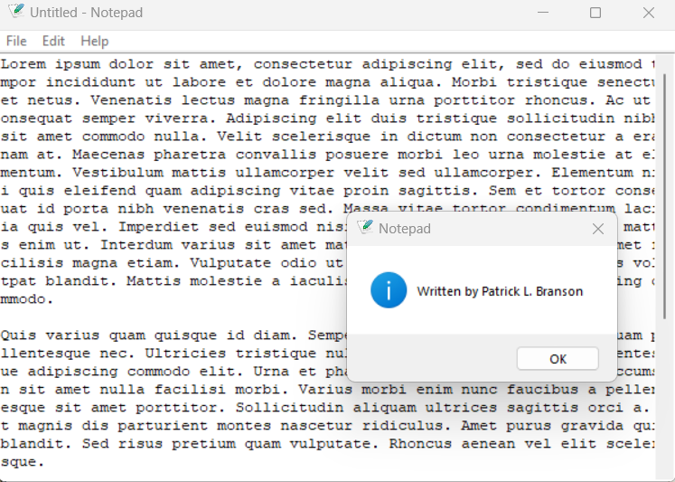

# notepad
Notepad in Python

## License
Please see [Apache 2.0 License](./LICENSE) for details

## Image Example

## Reference
Verma, M., & Sanchhaya Education Private Limited. (2021, September 7). <i>Make Notepad using Tkinter</i>. 
GeeksforGeeks; Sanchhaya Education Private Limited. https://www.geeksforgeeks.org/make-notepad-using-tkinter/
